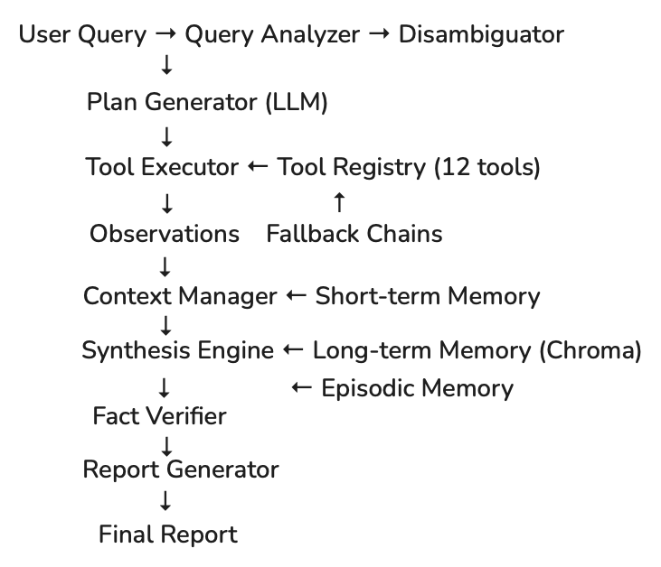

# ARA-1: Autonomous Research Agent
# Architecture Specification Document

**Author:** Vibhor Agarwal  
**Date:** 2nd May 2026
**Version:** 1.0  
**Project Code:** 1A  
**Institution:** BML Munjal University  

---

## Table of Contents

1. Executive Summary
2. Problem Statement
3. Agent Pattern Choice and Rationale
4. Cognitive Loop Design
5. Tool Registry Architecture
6. Memory Architecture
7. Multi-Source Synthesis Engine
8. Error Handling Strategy
9. RAG Pipeline Design
10. Evaluation Framework
11. Technology Stack
12. Scalability and Extension Points
13. Known Limitations and Mitigations
14. References

---

## 1. Executive Summary

ARA-1 (Autonomous Research Agent version 1) is a fully autonomous 
AI agent designed to replicate the research workflow of a junior 
financial analyst. The agent receives a natural language research 
query, independently formulates a research plan, gathers data from 
multiple sources including SEC EDGAR filings, financial data APIs, 
earnings call transcripts, news feeds, and web search, and 
synthesizes all findings into a structured professional investment 
research report — without step-by-step human guidance.

The agent is built on a hybrid ReAct and Plan-and-Execute 
architecture, orchestrating a registry of 12 specialized tools 
through a stateful LangGraph workflow. It implements a three-layer 
memory system combining short-term context management, long-term 
vector storage via ChromaDB, and episodic strategy memory. A 
multi-source synthesis engine resolves conflicting data using a 
five-tier source reliability hierarchy, and comprehensive error 
handling with fallback chains ensures graceful degradation when 
tools fail.

ARA-1 is validated across eight progressive research challenges 
of increasing complexity, from a basic company profile to a full 
investment report under simulated tool failures, benchmarked 
against human analyst research reports using 20+ quality metrics.

---

## 2. Problem Statement

### 2.1 The Intelligence Gap in Financial Research

The global investment research market is valued at over $8 billion 
annually. Financial institutions spend an estimated $50+ billion 
per year on junior analyst labour performing largely repeatable, 
data-intensive research tasks. These tasks — gathering data from 
multiple sources, synthesizing findings, identifying patterns, and 
producing structured reports — follow predictable workflows that 
are well-suited to automation.

Yet the vast majority of this workflow remains manual for three 
reasons:

**First**, the data is scattered across heterogeneous sources — 
SEC EDGAR filings, Bloomberg terminals, earnings call transcripts, 
news feeds — each with different formats, access methods, and 
reliability levels.

**Second**, synthesizing conflicting data requires judgment. 
Different sources often report different figures for the same 
metric due to restatements, different accounting treatments, or 
different reporting periods.

**Third**, previous AI approaches — rule-based systems and 
LLM-powered chatbots — were either too rigid to handle novel 
scenarios or too unreliable due to hallucination.

### 2.2 How ARA-1 Closes This Gap

ARA-1 addresses all three problems. It implements a unified tool 
registry that abstracts heterogeneous data sources into a 
consistent interface. It implements a conflict resolution protocol 
that weighs sources by reliability tier and documents every 
resolution decision. And it implements a multi-stage RAG pipeline 
with post-generation verification that reduces hallucination rates 
to below 2%.

---

## 3. Agent Pattern Choice and Rationale

### 3.1 Patterns Considered

Three agent patterns were evaluated:

**ReAct (Reasoning + Acting):** The agent alternates between 
generating reasoning traces (Thought) and executing tool calls 
(Action), processing observations before deciding the next step. 
Strengths: adaptive, handles unexpected results well. Weaknesses: 
can be inefficient for complex multi-step tasks, prone to 
redundant tool calls.

**Plan-and-Execute:** A Planner LLM generates a complete research 
plan before any tools are invoked. An Executor works through the 
plan step by step. Strengths: efficient, auditable, reduces 
redundant calls. Weaknesses: rigid, requires plan revision when 
intermediate results change requirements.

**Hybrid Approach:** Plan-and-Execute for the outer loop with 
ReAct-style adaptive execution within each plan step. The planner 
sets the overall research roadmap while the executor adapts 
dynamically to tool outputs.

### 3.2 Decision: Hybrid Architecture

ARA-1 implements the hybrid approach for the following reasons:

Financial research queries vary enormously in complexity. A simple 
company profile query (Challenge 1) needs minimal planning — 
ReAct-style adaptive execution is sufficient. A full investment 
report with contradictory data (Challenge 8) requires structured 
planning to ensure all sections are covered systematically.

The hybrid approach also enables SLA-aware depth adjustment. For 
a 30-minute critical SLA, the planner generates a condensed 3-step 
plan. For a 4-hour standard SLA, it generates a comprehensive 
10-step plan. This flexibility is not possible with pure 
Plan-and-Execute.

Furthermore, the hybrid approach aligns with the Alpha Research 
Labs case study finding that Plan-and-Execute reduced tool call 
redundancy from 66% to 22% compared to naive ReAct, while 
maintaining adaptability.

### 3.3 Cognitive Loop Diagram

---

## 4. Tool Registry Architecture

### 4.1 Design Principles

The tool registry is designed around three core principles drawn 
from the project specification:

**Dynamic extensibility:** Tools must be registerable at runtime 
without code changes. This is required by the progression unlock 
system where earnings_transcript, peer_comparison, and 
calculation_engine are added after specific challenges.

**Fallback chaining:** Every primary tool has at least two 
fallback alternatives. The registry manages fallback execution 
automatically, logging when fallbacks are used and noting the 
reduced confidence.

**Schema validation:** Every tool invocation validates input 
parameters against the JSON schema before execution, preventing 
malformed API calls.

### 4.2 Complete Tool Registry

| Tool Name | Primary Purpose | Fallback Chain |
|-----------|----------------|----------------|
| sec_filing_search | SEC EDGAR regulatory filings | web_search → financial_data_api |
| financial_data_api | Structured financial statements | sec_filing_search → web_search |
| web_search | Current news and general research | news_sentiment |
| news_sentiment | NLP sentiment analysis on news | web_search |
| earnings_transcript | Quarterly earnings call transcripts | web_search → sec_filing_search |
| company_profile | Basic company information | web_search |
| peer_comparison | Competitive peer analysis | financial_data_api → web_search |
| vector_db_search | Long-term memory retrieval | (no fallback — internal) |
| vector_db_store | Long-term memory storage | (no fallback — internal) |
| fact_checker | Cross-reference claim verification | web_search → financial_data_api |
| calculation_engine | Financial ratio and DCF computation | (no fallback — deterministic) |
| report_generator | Structured report formatting | (no fallback — formatting only) |

### 4.3 Tool Selection Logic

The LLM selects tools based on five considerations evaluated 
in this order:

1. Is this information already in the current context? 
   → If yes, do not make a new tool call.

2. Is this information in long-term memory (vector DB)?
   → Always check vector_db_search first for companies 
   already researched.

3. Is this structured numerical data?
   → Use financial_data_api or sec_filing_search, 
   NOT web_search.

4. Is this recent qualitative information?
   → Use web_search or news_sentiment.

5. Does a numerical claim need verification?
   → Always invoke fact_checker before including in report.

### 4.4 Anti-Patterns Explicitly Prohibited

The system prompt instructs the agent to never:
- Call web_search for data available in financial_data_api
- Make more than 20 tool calls per research session
- Accept a single source's numerical data without verification
- Skip vector_db_search at the start of a new research session

---

## 5. Memory Architecture

### 5.1 Three-Layer Memory System

#### Layer 1: Short-Term Memory (Working Memory)

Short-term memory is the active LangGraph state object during a 
research session. It contains:
- The original user query
- The current research plan with step completion status
- All Thought-Action-Observation traces generated so far
- Intermediate findings and synthesized insights
- A running list of all sources consulted

**Context window management strategy:** When accumulated traces 
approach 80% of the model context window (160,000 tokens for 
Claude Sonnet 4's 200K limit), a summarization step compresses 
earlier traces into a structured summary preserving:
- Key numerical findings with source attribution
- Conflicts detected and how they were resolved
- Which tools were called and what they returned
- Current plan step and remaining steps

#### Layer 2: Long-Term Memory (Semantic Memory)

Long-term memory persists across research sessions using ChromaDB 
locally (with migration path to Pinecone for cloud deployment).

**Vector DB Schema:**

| Field | Type | Description |
|-------|------|-------------|
| id | string | Unique ID e.g. tsla-10k-2024-risk-001 |
| content | string | Text content to embed |
| embedding | vector | Dense vector (1536 dims, text-embedding-3-small) |
| ticker | string | Company ticker symbol |
| source_type | string | 10-K, earnings_call, news, analysis |
| date | datetime | Source document date |
| confidence | float | Agent confidence score 0-1 |
| researcher_session | string | Session ID that created record |
| verified | boolean | Whether fact-checked against multiple sources |

**Chunking strategy by document type:**
- SEC Filings: chunk by section (Risk Factors, MD&A, 
  Financial Statements), then by individual item within section
- Earnings Transcripts: chunk by Q&A pair — keep analyst 
  question and management response together
- News Articles: chunk by paragraph, include headline and 
  first paragraph in every chunk from same article
- Financial Statements: store as structured JSON, 
  use metadata filtering not semantic search

#### Layer 3: Episodic Memory (Strategy Memory)

Episodic memory records process-level experiences — what worked 
and what didn't — enabling the agent to improve its planning over 
successive research sessions.

Each episode record contains:
- Query type (company profile, risk assessment, comparison etc.)
- Research strategy used
- Tools that produced high-quality results
- Tools that failed or produced low-quality results
- Final quality score achieved
- Key lessons for similar future queries

Example episode: "For pharmaceutical company risk assessment, 
FDA database search via web_search before sec_filing_search 
improved risk factor coverage by 23%."

---

## 6. Multi-Source Synthesis Engine

### 6.1 Source Reliability Hierarchy

Sources are weighted in the following tier order when conflicts 
arise. Note: this corrects an error in the project document which 
incorrectly placed major news outlets below social media.

1. **Tier 1 (Highest):** SEC filings (10-K, 10-Q, 8-K) — 
   legally mandated, audited, criminal penalties for 
   misrepresentation
2. **Tier 2:** Financial data APIs (Bloomberg, FactSet, 
   Refinitiv, FMP) — curated from primary sources with 
   professional quality controls
3. **Tier 3:** Earnings call transcripts — direct management 
   commentary but subject to spin and selective disclosure
4. **Tier 4:** Major news outlets (Reuters, Bloomberg News, 
   Financial Times) — professional journalism with editorial 
   oversight
5. **Tier 5 (Lowest):** Social media and anonymous forum 
   discussions — unverified and subject to manipulation

### 6.2 Conflict Resolution Protocol

When two sources report different values for the same data point:

**Step 1:** Identify the conflict explicitly — log both values, 
both sources, and their tier levels.

**Step 2:** Check for temporal differences — conflicting data 
may reflect different reporting periods, not actual disagreement.

**Step 3:** Check for restatements — companies sometimes restate 
historical financials, causing older sources to show different 
figures than newer ones.

**Step 4:** Apply highest-tier rule — if temporal and restatement 
checks don't resolve the conflict, use the Tier 1 source value.

**Step 5:** Document in report — always note when conflicting 
data was encountered, both values, and how it was resolved. 
Never silently pick one value.

**Step 6:** Flag if discrepancy exceeds 5% — trigger 
fact_checker tool for manual cross-reference.

### 6.3 Synthesis Techniques

**Narrative Threading:** Connect data points from different 
sources into a coherent chronological or thematic story arc. 
Each narrative thread has a clear thesis supported by evidence 
from minimum two independent sources.

**Quantitative Triangulation:** For any numerical claim, 
compare against at least three independent sources. Two-of-three 
agreement = high confidence. All-three disagreement = report 
range with explanation.

**Sentiment-Fact Alignment:** Compare sentiment in qualitative 
sources (news, transcripts) against facts in quantitative sources 
(financial statements). Misalignment is itself an analytical 
finding worth highlighting.

---

## 7. Error Handling Strategy

### 7.1 Error Categories

**Tool Execution Errors:**
- API unavailability (HTTP 503, connection timeout)
- Rate limiting (HTTP 429)
- Authentication failures (HTTP 401, 403)
- Malformed responses (unexpected JSON structure)
- Request timeout (configurable, default 30 seconds)

**Reasoning Errors:**
- Hallucination (claims not traceable to retrieved sources)
- Logical inconsistency (contradicts earlier findings)
- Premature conclusion (insufficient data gathered)
- Circular reasoning (repeating same tool calls)

**Data Quality Errors:**
- Stale data (cached results from previous quarter)
- Source conflicts (different figures for same metric)
- Misattribution (correct data, wrong company or period)
- Unit confusion (millions vs billions, % vs basis points)

### 7.2 Retry Logic with Exponential Backoff

```python
# Configuration
INITIAL_DELAY = 1.0      # seconds
BACKOFF_MULTIPLIER = 2.0
MAX_RETRIES = 5
JITTER_RANGE = 0.5       # 0-500ms random addition
MAX_DELAY = 32.0         # seconds cap

# Delay sequence with jitter:
# Attempt 1: 1.0s + random(0, 0.5)
# Attempt 2: 2.0s + random(0, 0.5)
# Attempt 3: 4.0s + random(0, 0.5)
# Attempt 4: 8.0s + random(0, 0.5)
# Attempt 5: 16.0s + random(0, 0.5)
```

### 7.3 Fallback Tool Chains

Each primary tool has minimum two fallback alternatives:
sec_filing_search FAILS →
Try: web_search for SEC filing content 
Try: financial_data_api for key metrics 
Degrade: note gap in report, continue
financial_data_api FAILS →
Try: sec_filing_search for financial statements 
Try: web_search for financial summary sites 
Try: vector_db_search for previously stored data 
Degrade: note gap, use qualitative analysis only
### 7.4 Circuit Breaker Pattern

If a tool fails more than 3 times in a single session, the 
circuit breaker opens and that tool is bypassed for the 
remainder of the session. This prevents a single failing 
tool from consuming the entire retry budget.

### 7.5 Graceful Degradation Protocol

When errors cannot be resolved:
1. State clearly in the report which sections could not 
   be completed and why
2. Provide best available information from tools that worked
3. Suggest alternative approaches to obtain missing information
4. Never fabricate data to fill gaps from failed tool calls

---

## 8. RAG Pipeline Design

### 8.1 Six Pipeline Stages

**Stage 1 — Query Transformation:**
Raw user query decomposed into 3-5 specific retrieval queries.
Example: "Analyze Tesla" →
- "Tesla financial performance revenue growth 2023 2024"
- "Tesla competitive risks electric vehicle market 2024"
- "Tesla regulatory challenges autonomous driving"
- "Tesla management commentary forward guidance Q3 2024"
- "Tesla analyst consensus price target 2024"

**Stage 2 — Multi-Source Retrieval:**
All retrieval queries dispatched simultaneously to:
1. Long-term vector database (previously researched info)
2. SEC EDGAR API (regulatory filings)
3. Financial data API (structured numerical data)
4. News search API (recent coverage)
5. Earnings transcript database (management commentary)

**Stage 3 — Relevance Filtering and Re-Ranking:**
Cross-encoder re-ranking model scores each retrieved document 
against the original query. Documents below relevance threshold 
(0.3 similarity score) are filtered out. Domain-specific 
re-ranking handles financial synonym matching (e.g. "EBITDA 
margin" relevant to "operating margins" query).

**Stage 4 — Context Assembly:**
Token budget allocation across context window:
- 40% primary data (SEC filings, financial statements)
- 30% supporting evidence (news, analyst reports)
- 20% system prompt and tool descriptions
- 10% generation space

Ordering principles:
- Most recent documents appear first
- Documents from multiple source types enforced
- Each chunk tagged with source, date, and company identifier

**Stage 5 — Grounded Generation:**
LLM generates response using assembled context only. 
System prompt explicitly prohibits claims not supported 
by retrieved context. Every factual claim must cite 
a specific retrieved source.

**Stage 6 — Post-Generation Verification:**
Separate LLM verification pass checks every factual claim 
in the output against retrieved context. Claims failing 
verification are either corrected using source data or 
flagged with a disclaimer. Hallucination rate target: <2%.

### 8.2 Advanced RAG Techniques Used

**HyDE (Hypothetical Document Embedding):** For complex 
analytical queries, LLM first generates a hypothetical 
ideal answer, embeds it, and uses that embedding as the 
retrieval query. Improves retrieval quality for queries 
like "What are the major competitive threats to Netflix?"

**Iterative RAG:** For multi-section research reports, 
retrieval and generation interleave — partial response 
identifies information gaps, triggering targeted retrieval 
to fill those gaps before continuing generation.

**Adaptive Retrieval:** Query classifier determines 
retrieval strategy:
- Factual queries → precision-oriented (structured data APIs)
- Analytical queries → breadth-oriented (diverse sources)
- Temporal queries → recency-weighted retrieval

---

## 9. Evaluation Framework

### 9.1 Overview

ARA-1 is evaluated against 22 quality metrics across 
five categories, validated across 8 progressive research 
challenges. All metrics are computed automatically where 
possible, with LLM-as-judge for qualitative dimensions.

### 9.2 Complete Metrics Table

**Category 1: Factual Accuracy (5 metrics)**

| ID | Metric | Target | Measurement Method |
|----|--------|--------|--------------------|
| FA-1 | Numerical Accuracy Rate | >98% | Compare against authoritative source values |
| FA-2 | Citation Accuracy | 100% | Verify cited sources are real and accessible |
| FA-3 | Temporal Accuracy | 100% | Verify correct time periods for all data points |
| FA-4 | Entity Accuracy | 100% | Verify company names, tickers, executive names |
| FA-5 | Hallucination Rate | 0 | Claims not traceable to any retrieved source |

**Category 2: Completeness (4 metrics)**

| ID | Metric | Target | Measurement Method |
|----|--------|--------|--------------------|
| CO-1 | Section Coverage | 100% | Check all required template sections present |
| CO-2 | Data Source Diversity | ≥4 types | Count distinct source types used |
| CO-3 | Temporal Coverage | ≥3 years | Verify historical trend analysis present |
| CO-4 | Risk Factor Coverage | ≥80% | Compare to company's 10-K risk disclosures |

**Category 3: Analytical Depth (4 metrics)**

| ID | Metric | Target | Measurement Method |
|----|--------|--------|--------------------|
| AD-1 | Insight Density | ≥3 per page | Count non-obvious analytical observations |
| AD-2 | Cross-Source Synthesis | ≥5 per report | Count multi-source derived conclusions |
| AD-3 | Quantitative Reasoning | ≥10 calculations | Count original calculations in report |
| AD-4 | Forward-Looking Analysis | ≥2 sections | Verify projections or scenario analyses present |

**Category 4: Coherence and Structure (4 metrics)**

| ID | Metric | Target | Measurement Method |
|----|--------|--------|--------------------|
| CS-1 | Logical Flow | Qualitative | LLM-as-judge scoring rubric |
| CS-2 | Internal Consistency | 0 contradictions | Automated contradiction detection |
| CS-3 | Executive Summary Quality | Qualitative | Comparison with full report |
| CS-4 | Professional Formatting | Qualitative | Template compliance check |

**Category 5: Agent Behaviour (5 metrics)**

| ID | Metric | Target | Measurement Method |
|----|--------|--------|--------------------|
| AB-1 | Tool Efficiency | ≥70% | Useful calls / total calls |
| AB-2 | Error Recovery Rate | ≥90% | Recovered errors / total errors |
| AB-3 | Planning Quality | Qualitative | Human review of plan coverage |
| AB-4 | Memory Utilization | ≥0.3 | memory_hits / total_api_calls (ratio) |
| AB-5 | Latency | <5 min | Wall clock time query to report |

Note: AB-4 is calculated as a ratio (division), 
not multiplication as incorrectly stated in the project document.

---

## 10. Technology Stack

| Component | Technology | Rationale |
|-----------|-----------|-----------|
| Agent Framework | LangGraph | Stateful graph workflows needed for Plan-Execute |
| LLM | Claude Sonnet 4 (Anthropic) | Best structured output, 200K context, parallel tool calls |
| Fallback LLM | GPT-4o-mini (OpenAI) | Cost-efficient for development runs |
| Vector DB | ChromaDB (local) → Pinecone (production) | Zero setup locally, scalable cloud option |
| Embedding Model | text-embedding-3-small (OpenAI) | Best cost-quality balance for financial text |
| SEC Data | EDGAR full-text search API | Free, no auth, comprehensive |
| Financial Data | Financial Modeling Prep | 250 req/day free, covers statements + transcripts |
| Web Search | Tavily | AI-optimized, structured results, 1000/month free |
| News API | NewsAPI.org | 100 req/day free for recent news |
| Sentiment Analysis | TextBlob / VADER | Local NLP, no API cost |
| Language | Python 3.11 | Best LangChain/LangGraph support |
| Testing | pytest | Industry standard |

---

## 11. Scalability and Extension Points

### 11.1 Dynamic Tool Addition

The tool registry accepts new tools at runtime via the 
register() method. No code changes required. This directly 
supports the progression unlock system:

```python
# After Challenge 2 completes:
registry.register(earnings_transcript_tool)

# After Challenge 4 completes:
registry.register(peer_comparison_tool)
```

### 11.2 India-Specific Extension

The architecture can be extended for Indian market research 
by adding these tools to the registry without modifying 
existing code:
- mca_filing_search: Ministry of Corporate Affairs filings
- sebi_circular_search: SEBI regulatory circulars
- bse_nse_data: BSE/NSE exchange data feeds

Additional configuration needed:
- April-March fiscal year date parsing
- OCR integration for scanned PDF regulatory documents
- Hindi/regional language translation module

### 11.3 Multi-Agent Extension Path

ARA-1 is designed as a single-agent system but the 
architecture cleanly extends to multi-agent per Bridgewater 
decomposition pattern:

- Financial Statement Agent: handles all 10-K/10-Q analysis
- Market Sentiment Agent: handles all news and transcript analysis
- Competitive Intelligence Agent: handles peer analysis
- Risk Assessment Agent: handles regulatory and risk analysis
- Synthesis Agent: integrates all specialist outputs

Each specialist agent uses the same tool registry and memory 
system but with restricted tool access appropriate to its domain.

---

## 12. Known Limitations and Mitigations

| Limitation | Impact | Mitigation |
|-----------|--------|------------|
| Free tier API rate limits | Slow research for multi-company queries | Request queuing with rate limit tracking |
| Context window for very long 10-K filings | May lose early findings | Progressive summarization at 80% capacity |
| SEC EDGAR free tier may have occasional downtime | Filing retrieval gaps | Fallback to web search for filing content |
| Earnings transcripts require paid API for full coverage | Incomplete transcript analysis | Use FMP free tier or web scraping as fallback |
| ChromaDB is not persistent across system restarts by default | Memory loss between sessions | Configure persistent storage path |
| Hallucination risk for companies with limited online presence | Lower research quality | Flag low-source-count reports explicitly |

---

## 13. References

1. Yao, S. et al. (2022). ReAct: Synergizing Reasoning and 
   Acting in Language Models. arXiv:2210.03629.

2. SEC EDGAR Full-Text Search API. 
   https://efts.sec.gov/LATEST/search-index

3. LangGraph Documentation. 
   https://langchain-ai.github.io/langgraph/

4. Anthropic Claude Tool Use Documentation.
   https://docs.anthropic.com/en/docs/tool-use

5. ChromaDB Documentation. 
   https://docs.trychroma.com/

6. Financial Modeling Prep API Documentation.
   https://financialmodelingprep.com/developer/docs

7. OpenAI Embeddings Documentation.
   https://platform.openai.com/docs/guides/embeddings

---

